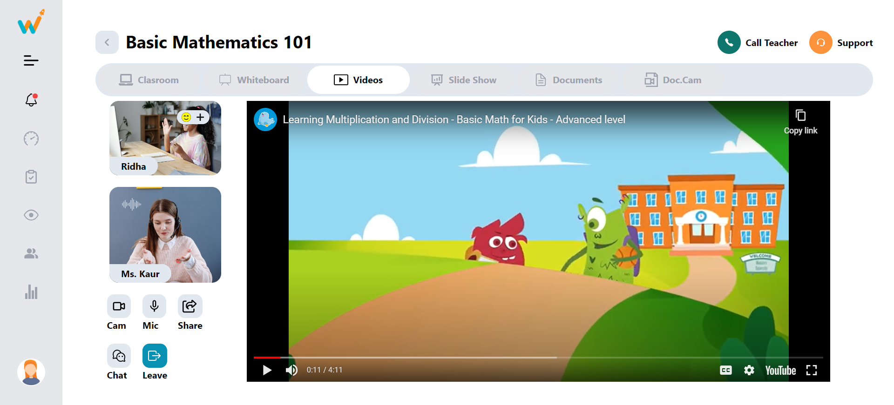

# Online Teaching Platform

It is a online teaching platform developed using ReactJS, designed to provide a interactive life class experience. This project utilizes Tailwind CSS for a clean and responsive user interface.

## Live
<a href="https://tukidoo.vercel.app/">Live Link</a>



## Features

- **Teaching Screen:** View and interact with the Teacher in live class.
- **Menu Bar:** Check notification and different menu features.
- **Top Navbar:** Access different tools in the live class like Videos, Whiteboard, Documents, Slideshow.

## Technologies Used

- ReactJS
- Tailwind CSS
- JavaScript

## Getting Started

To run the CoRider Chats application locally, follow these steps:

1. Clone this repository:

```bash
git clone https://github.com/your-username/tukidoo-assignment.git

cd tukidoo-assignment
```

2. Install dependencies:

```bash
npm install
```

3. Start the development server:

```bash
npm start
```

The application will be accessible at `http://localhost:3000` by default.

## Deployment

You can deploy this application on platforms like Netlify, Vercel, or any other of your choice.

## Folder Structure

```plaintext
src/
|-- components/
|   |-- Content.js
|   |-- Header.js
|   |-- Interaction.js
|   |-- SideNavbar.js
|   |-- TopNavbar.js
|   |-- VideoPlayer.js
|-- App.js
|-- index.js
|-- ...
```

## Contributing

Contributions are welcome! Feel free to open issues and pull requests.

---

**Happy Coding!**
